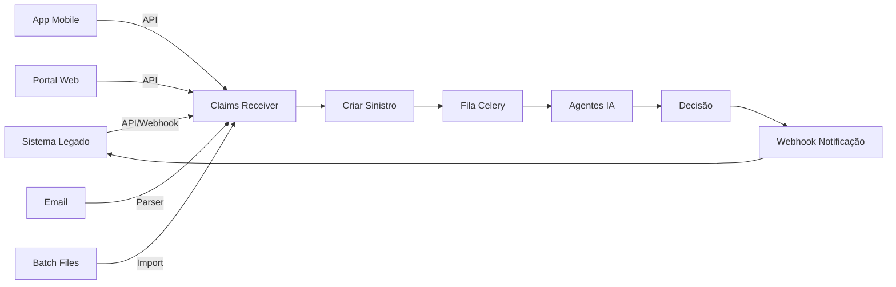

# 🚀 Guia de Produção - Sistema de Sinistros com IA

## 📋 Checklist de Produção

### 1. **Configurar Variáveis de Ambiente** ✅
```bash
# Copiar arquivo de produção
cp .env.production .env

# Editar com suas credenciais reais
nano .env
```

**Variáveis essenciais:**
- `OPENAI_API_KEY` - Sua chave da OpenAI
- `DATABASE_URL` - URL do PostgreSQL
- `LEGACY_SYSTEM_URL` - URL do seu sistema atual
- `SECRET_KEY` - Gerar com: `openssl rand -hex 32`
- `SENTRY_DSN` - Para monitoramento de erros

### 2. **Conectar com Sistema Existente** 🔌

O sistema já está preparado para receber sinistros de múltiplos canais:

```python
# Exemplo: Receber do sistema legado
from src.connectors.claims_receiver import receive_claim_from_channel

# Dados no formato do seu sistema
legacy_data = {
    "PolicyNumber": "APL-2024-001",
    "ClaimDate": "2024-01-15T10:30:00",
    "InsuredName": "João Silva",
    "InsuredDocument": "123.456.789-00",
    "Description": "Colisão frontal",
    "EstimatedAmount": 15000.00
}

# Processar sinistro
numero_sinistro = receive_claim_from_channel('legacy', legacy_data)
```

### 3. **Deploy com Docker** 🐳

```bash
# Build e iniciar todos os serviços
docker-compose up -d

# Verificar se está tudo rodando
docker-compose ps

# Ver logs
docker-compose logs -f api
```

**Serviços incluídos:**
- PostgreSQL (porta 5432)
- Redis (porta 6379)
- API Principal (porta 8000)
- Celery Workers (processamento)
- Flower (monitoramento - porta 5555)
- Dashboard (porta 8080)
- Prometheus (métricas - porta 9090)

### 4. **Configurar Banco de Dados** 💾

```bash
# Criar tabelas (automático no Docker)
docker-compose exec api python -m src.database.connection init_db

# Ou manualmente
docker-compose exec postgres psql -U sinistros_user -d sinistros_db
```

### 5. **Integração com Sistema Legado** 🔄

**Opção A: Via API REST**
```python
# Endpoint para receber sinistros
POST https://seu-dominio.com/api/v1/sinistros
Content-Type: application/json

{
    "data_ocorrencia": "2024-01-15T10:30:00",
    "segurado_nome": "João Silva",
    "segurado_documento": "123.456.789-00",
    "apolice_numero": "APL-2024-001",
    "descricao": "Descrição do sinistro",
    "valor_estimado": 15000.00
}
```

**Opção B: Via Webhook**
Configure seu sistema para enviar webhooks:
```python
# Seu sistema envia para:
POST https://seu-dominio.com/api/v1/webhooks/sinistro
```

**Opção C: Via Batch/Arquivo**
```python
# Processar arquivo CSV/Excel
from src.connectors.claims_receiver import BatchFileReceiver

receiver = BatchFileReceiver()
for row in csv_data:
    receiver.receive_claim(row, 'batch')
```

### 6. **Configurar Filas Assíncronas** ⚡

```bash
# Verificar workers rodando
docker-compose exec flower celery -A src.workers.celery_app status

# Monitorar filas via Flower
http://localhost:5555
```

### 7. **Monitoramento e Logs** 📊

**Prometheus Metrics:**
```
http://localhost:9090/metrics
```

**Logs estruturados:**
```bash
# Ver logs em tempo real
docker-compose logs -f api celery_worker

# Logs em JSON para análise
tail -f logs/app.log | jq '.'
```

**Sentry (erros):**
Configure `SENTRY_DSN` no `.env`

### 8. **Webhooks de Notificação** 🔔

O sistema notifica automaticamente:
- `sinistro.criado` - Quando novo sinistro é recebido
- `analise.iniciada` - Quando análise começa
- `analise.concluida` - Quando agentes terminam
- `decisao.tomada` - Quando há decisão final

### 9. **Segurança** 🔒

- [ ] Configurar HTTPS/SSL
- [ ] Definir `SECRET_KEY` forte
- [ ] Configurar firewall
- [ ] Limitar CORS origins
- [ ] Configurar rate limiting
- [ ] Validar tokens JWT

### 10. **Backup e Recovery** 💾

```bash
# Backup do banco
docker-compose exec postgres pg_dump -U sinistros_user sinistros_db > backup.sql

# Restore
docker-compose exec -T postgres psql -U sinistros_user sinistros_db < backup.sql
```

## 🎯 Fluxo de Integração



## 📝 Exemplo Completo de Integração

```python
# integrar_sistema_existente.py
import requests
from datetime import datetime

# 1. Receber sinistro do seu sistema
def processar_sinistro_legado(dados_legado):
    # Transformar para formato da API
    payload = {
        "data_ocorrencia": dados_legado["data_sinistro"],
        "segurado_nome": dados_legado["nome_cliente"],
        "segurado_documento": dados_legado["cpf_cnpj"],
        "apolice_numero": dados_legado["numero_apolice"],
        "descricao": dados_legado["descricao_ocorrencia"],
        "valor_estimado": float(dados_legado["valor_prejuizo"]),
        "canal_origem": "sistema_legado",
        "metadata": {
            "id_legado": dados_legado["id"],
            "origem": "integracao_automatica"
        }
    }
    
    # 2. Enviar para API de IA
    response = requests.post(
        "http://localhost:8000/api/v1/sinistros",
        json=payload,
        headers={"Authorization": "Bearer seu-token"}
    )
    
    if response.status_code == 200:
        resultado = response.json()
        numero_sinistro = resultado["numero_sinistro"]
        
        # 3. Iniciar análise automática
        analise_response = requests.post(
            f"http://localhost:8000/api/v1/sinistros/{numero_sinistro}/analisar",
            json={"prioridade": 5}
        )
        
        return {
            "sucesso": True,
            "numero_sinistro": numero_sinistro,
            "mensagem": "Sinistro enviado para análise dos agentes de IA"
        }
    
    return {"sucesso": False, "erro": response.text}
```

## 🚨 Troubleshooting

**API não conecta:**
```bash
docker-compose logs api
# Verificar se banco está up
docker-compose exec api python -c "from src.database.connection import engine; print(engine.url)"
```

**Celery não processa:**
```bash
# Verificar filas
docker-compose exec redis redis-cli -n 1 LLEN celery
# Restart workers
docker-compose restart celery_worker
```

**Agentes retornam erro:**
- Verificar `OPENAI_API_KEY` está configurada
- Verificar limites de rate da OpenAI
- Ver logs: `docker-compose logs celery_worker`

## 📞 Suporte

Para dúvidas sobre integração:
1. Verificar logs detalhados
2. Consultar métricas no Prometheus
3. Verificar documentação da API em `/docs`

Pronto para produção! 🎉
